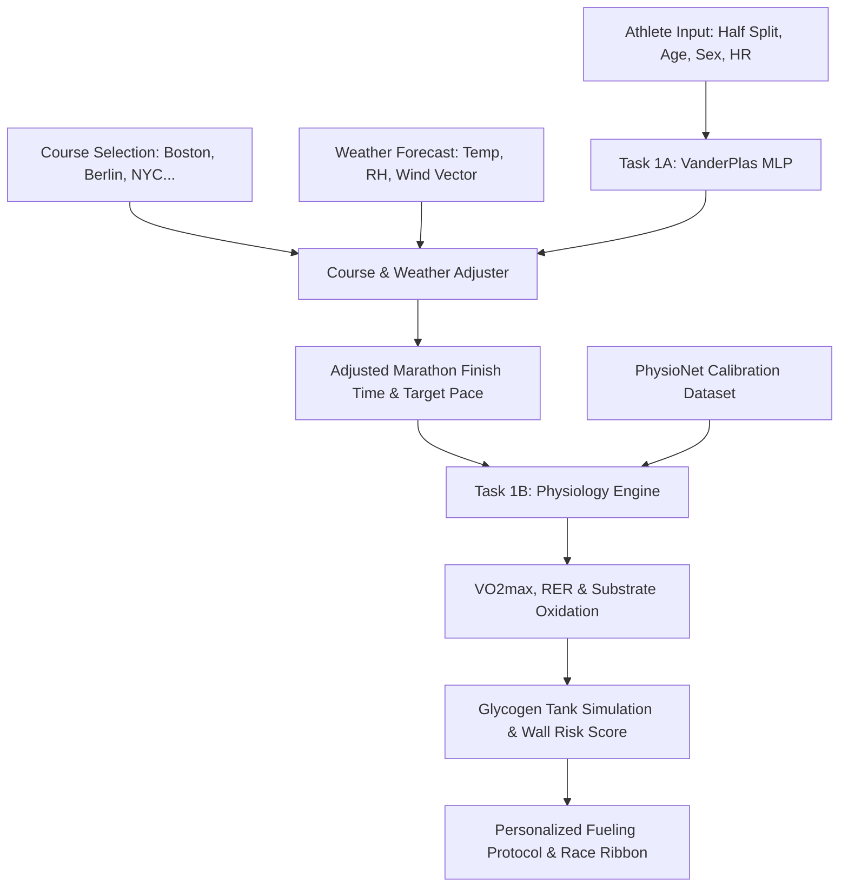

# Stride v3 — Decision-Support Platform for Endurance Athletes
**Team Kiboko** · Stride Final Project

[](https://fastapi.tiangolo.com)
[](https://pytorch.org)
[](https://react.dev)
[](https://vitejs.dev)
[](https://tailwindcss.com)

---

## 1. Executive Summary

**Stride v3** is an advanced decision-support system designed for endurance athletes and coaches. Rather than functioning as a simplistic pace calculator, Stride integrates:
1. **Task 1A: Machine Learning Performance Engine** — Multi-Layer Perceptron (MLP) baseline predicting marathon finish times, enriched with sports-science heuristics for race course elevation difficulty, real-time heat stress (WBGT / Dew Point), and aerodynamic wind vector decomposition (Headwind, Tailwind, Crosswind).
2. **Task 1B: Biomathematical Physiology & Nutrition Engine** — Calibrated against PhysioNet maximal treadmill exercise datasets, estimating athlete $VO_2\text{max}$, submaximal oxygen demand via ACSM equations, respiratory exchange ratios (RER), substrate oxidation ($g/\text{min}$ Carbohydrate vs. Fat), and an in-race Glycogen Balance Model to calculate "Wall Risk".

---

## 2. System Architecture



### Key Modules

- **Athlete Dashboard (`/app`)**: Central performance hub visualizing Base Pace vs. Environment-Adjusted Pace alongside $VO_2\text{max}$, RER, and real-time CHO burn rates.
- **Fuel Lab (`/fuel`)**: Interactive simulation adjusting gel/carb intake (up to the $90\,\text{g/h}$ physiological intestinal ceiling) with live glycogen depletion projections and pre-race carb-loading targets.
- **AI Prediction Lab (`/train`)**: Sandbox demonstrating ablation effects of temperature, humidity, and head/tail wind vectors on projected marathon finish time.
- **Race Plans (`/race-plans`)**: Wristband-printable "Race Ribbon" displaying mile-by-mile pacing, elevation profile, and nutritional intake checkpoints for race day.
- **Coach Workspace (`/coach`, `/coach/reviews`)**: Collaborative athlete roster and AI plan diff viewer for coaching review and approval.

---

## 3. Project Directory Structure

```
├── archive/
│   └── stride-app/               # Legacy Flask prototype & schema
├── data/
│   ├── VanderPlas.csv            # 37,250 marathon records for baseline MLP training
│   └── treadmill-.../            # PhysioNet maximal treadmill exercise test dataset
├── docs/
│   ├── Dataset Briefs...pdf      # Benchmark dataset documentation
│   ├── stride-concept-document   # Initial project concept specifications
│   ├── System_Design_Blueprint   # Architectural design blueprint
│   └── Stride_v3_Architecture... # Detailed architectural functionality report
├── ml/
│   ├── artifacts/                # Trained PyTorch model (.pth), scalers (.pkl), plots
│   ├── data/
│   │   ├── boston/results/       # Boston Marathon historical results (2001-2014)
│   │   └── weather_data.csv      # Historical weather data for race dates
│   ├── activity_utils.py         # Smartwatch / activity file parser & logger
│   ├── course_utils.py           # Major marathon elevation profiles & course difficulty
│   ├── eval_metrics.py           # Evaluation metrics (MAE, RMSE, R²)
│   ├── features.py               # Feature assembly for 5-model ablation study
│   ├── inference.py              # Single-runner prediction utility
│   ├── nutrition.py              # Glycogen balance and fueling plan generator
│   ├── physiology.py             # PhysioNet calibration, VO2max, and substrate oxidation
│   ├── requirements.txt          # Python dependencies
│   ├── run_experiments.py        # Ablation experiment runner
│   ├── server.py                 # FastAPI backend (port 8000)
│   ├── train_ablation.py         # Full ablation pipeline (Models A through E)
│   ├── train.py                  # PyTorch MLP training script
│   └── weather_utils.py          # WBGT, dew point, and wind vector decomposition
├── public/                       # PWA icons, manifest, and robots.txt
├── src/                          # React 19 / TanStack Start frontend application
│   ├── components/               # UI components, Radix primitives, Stride widgets
│   ├── routes/                   # File-based routes (app, fuel, train, coach, etc.)
│   ├── integrations/             # Supabase & authentication handlers
│   └── server.ts                 # Server-side request wrapper
├── vite.config.ts                # Vite config with API proxy to localhost:8000 & PWA
├── package.json                  # Frontend dependencies and scripts
└── tsconfig.json                 # TypeScript compiler configuration
```

---

## 4. Getting Started

### Prerequisites
- **Node.js**: v18+ (v20+ recommended)
- **Python**: 3.10+

---

### Backend Setup (FastAPI & ML Engine)

1. Navigate to the `ml/` directory or project root:
   ```bash
   cd ml
   python3 -m venv .venv
   source .venv/bin/activate
   pip install -r requirements.txt
   ```

2. Start the FastAPI development server:
   ```bash
   python server.py
   # Or using uvicorn:
   uvicorn server:app --host 127.0.0.1 --port 8000 --reload
   ```
   API docs will be available at: [http://127.0.0.1:8000/docs](http://127.0.0.1:8000/docs)

3. (Optional) Run Model Retraining or the Ablation Study:
   ```bash
   # Train baseline model and save artifacts
   python train.py

   # Run 5-stage ablation study (Models A through E)
   python train_ablation.py
   ```

---

### Frontend Setup (React & Vite PWA)

1. In the repository root, install dependencies:
   ```bash
   npm install
   ```

2. Start the development server:
   ```bash
   npm run dev
   ```
   The application will be live at: [http://localhost:3000](http://localhost:3000) (or specified port).
   Vite is configured to automatically proxy `/api/*` requests to the FastAPI server at `http://127.0.0.1:8000`.

---

## 5. API Endpoints Reference

| Method | Endpoint | Description |
| :--- | :--- | :--- |
| `POST` | `/predict/marathon` | Baseline VanderPlas MLP finish time prediction |
| `POST` | `/predict/marathon/v2` | Environment & course-adjusted finish time with slowdown % |
| `POST` | `/predict/full-plan/v2` | Master pipeline: Task 1A prediction chained into Task 1B physiology & fueling |
| `GET` | `/courses` | Presets for World Marathon Majors (Boston, Berlin, Chicago, NYC, Tokyo, London) |
| `GET` | `/courses/{id}/profile` | Elevation profile and grade metrics for a course |
| `POST` | `/weather/calculate` | WBGT, dew point, and headwind/crosswind/tailwind decomposition |
| `GET` | `/physiology/calibration` | Calibration report against PhysioNet treadmill measurements |
| `POST` | `/physiology/profile` | Standalone $VO_2\text{max}$ and substrate oxidation report |

---

## 6. License
Internal Project — Team Kiboko. All rights reserved.
